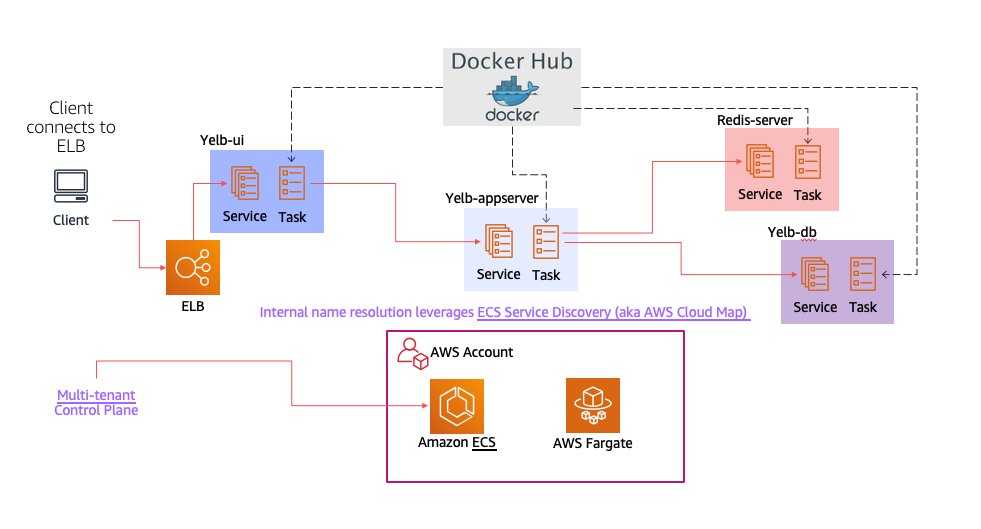

In this folder there are CDK artifacts to deploy Yelb. The CDK code allows to deploy on AWS Fargate only and it creates a dedicated ECS cluster and VPC. 

They are provided as basic examples of how to deploy Yelb on ECS. 

This is a visual representation of the ECS/Fargate deployment: 

 


**Deployment steps:**

1. Follow the steps mentioned in the ECS workshop to create a Cloud 9 workspace - https://ecsworkshop.com/start_the_workshop/workspace/

2. We will be using the [Cloud Development Kit](https://aws.amazon.com/cdk/) to deploy the yelb application in AWS Fargate on Amazon ECS. The CDK will already have been installed on Cloud 9 environment, check the CDK version by opening a terminal window and issuing the following command.

```
cdk --version
```

3. Clone the git repo

```
git clone https://github.com/cmanikandan/serverless-containers
```

4. Deploy the app using CDK using the following steps. Note, the AWS region in which the application will be deployed is based on the default region specified in your AWS profile. You can change it by using the ```aws configure``` command. 

```
cd /home/ec2-user/environment/serverless-containers/yelb/deployments/platformdeployment/AWS/ECS/cdk
npm install
cdk deploy
```

5. The yelb application would have been deployed in Amazon ECS. Access the load balancer to access the application. 
