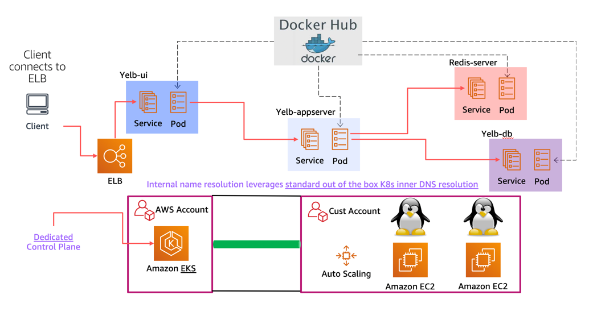

These configurations had been tested against against Amazon EKS but should in theory work on any Kubernetes deployment. 

Some of these configurations (e.g. *alb*) is AWS specific in that it requires an ALB ingress controller.  

The picture below shows the layout of the Kubernetes deployment (with a load balancer) on top of EKS:

 

